## blockr.dplyr

blockr.dplyr provides interactive blocks for data wrangling. Each block offers a user interface for a specific data transformation task. Blocks can be connected together to create data transformation pipelines.

This package includes blocks for common dplyr operations (select, filter, arrange, mutate, summarize, join, bind) and tidyr operations (pivot, separate, unite).

---

## Select Block

The select block chooses which columns to keep in your dataset.

Use the column selector to pick the columns you want. You can select multiple columns and reorder them by dragging. The order of selection determines the column order in the output.

The block includes a "distinct" option. When enabled, duplicate rows are removed from the result, keeping only unique combinations of the selected columns.

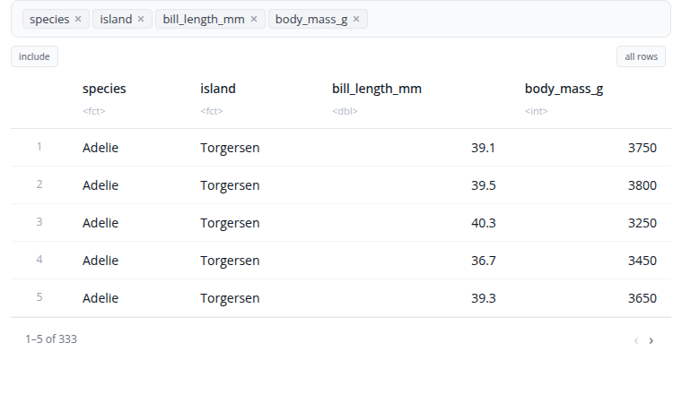

---

## Filter Block

The filter block filters rows using one or more conditions. A single block now covers all filtering needs — there's no separate "expression" variant. Add as many conditions as you like, each of one of three types:

- **Values** — pick a column and select values from a dropdown of all unique values in it. Choose `include` mode (keep matching rows) or `exclude` mode (remove them). Best for categorical columns.
- **Numeric** — pick a column, an operator (`>`, `>=`, `<`, `<=`, `is`, `is not`), and a value. Best for numeric comparisons.
- **Expression** — write a free R expression (e.g. `mpg > 20 & cyl == 4`, `hp > 100 & wt < 3`, `Species %in% c("setosa", "versicolor")`). Best for calculations or anything that doesn't fit the first two types.

Combine all conditions with a single AND/OR operator at the block level. Add conditions with the "+ Add Condition" button and remove them with the "×" button.

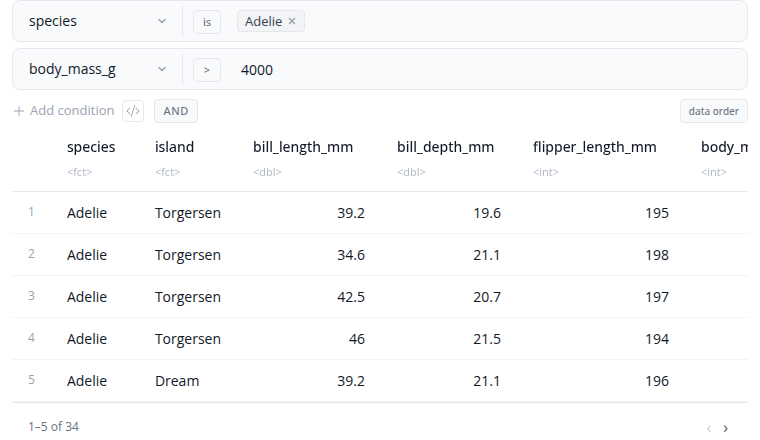

---

## Arrange Block

The arrange block sorts rows by column values. Select one or more columns to sort by, with each column having its own ascending or descending control.

When sorting by multiple columns, the order matters. The first column is the primary sort key. Rows with the same value in the first column are then sorted by the second column, and so on. Use the drag handles to reorder the sort columns.

Add columns using the "+" button and remove them using the "×" button. Toggle between ascending and descending order for each column independently.

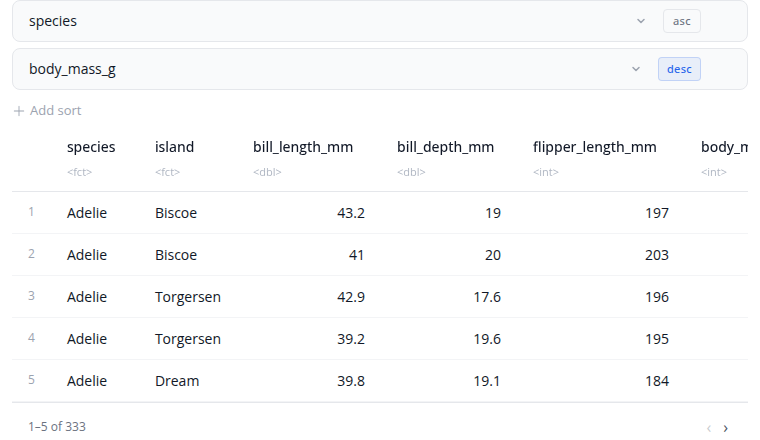

---

## Slice Block

The slice block selects specific rows based on different criteria. Choose from six slice types: head (first rows), tail (last rows), min (rows with smallest values), max (rows with largest values), sample (random selection), or custom (specific positions).

For head and tail types, specify the number of rows using n (count) or prop (proportion between 0 and 1). For min and max types, select an order_by column and enable with_ties if you want to include all rows with tied values. For sample type, optionally select a weight_by column for weighted sampling and enable replace for sampling with replacement.

The custom type accepts a rows expression like "1:5" or "c(1, 3, 5, 10)". All slice types support grouping via the by parameter, which performs the slice operation within each group separately.

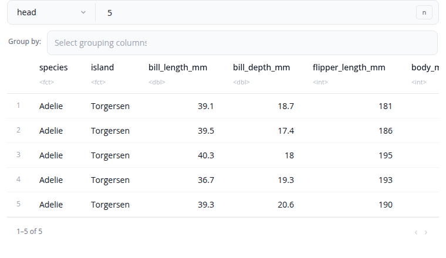

---

## Mutate Block

The mutate block creates new columns or modifies existing ones using R expressions. Each mutation is a `name = expression` pair: type the new column name and an R expression that computes its value.

Use mathematical operators (`+`, `-`, `*`, `/`, `^`) and functions (`sqrt()`, `log()`, `round()`, …). Reference existing columns by name. Conditional logic via `ifelse()` or `dplyr::case_when()` is supported.

Expression order matters: later mutations can reference columns created by earlier ones in the same block. The `by` parameter performs the mutate per group. Add mutations with the "+ Add Expression" button and remove them with the "×" button.

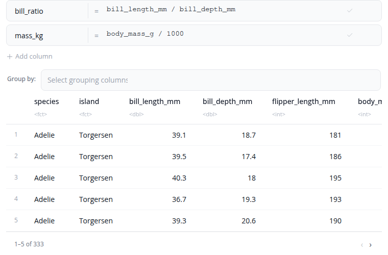

---

## Rename Block

The rename block changes column names. Each rename operation maps a new name to an existing column. The interface shows the mapping as "new_name ← old_name" with a visual arrow indicator.

Select the existing column from a dropdown to ensure valid column names. Type the new name in the text field. Add multiple renames using the "+" button to rename several columns at once. Remove a rename operation with the "×" button.

The block validates that you don't rename the same column twice and ensures column names don't conflict with existing names.

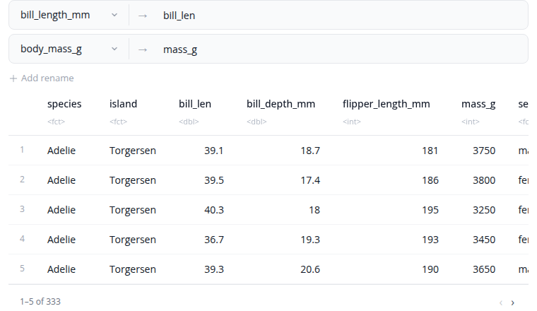

---

## Summarize Block

The summarize block calculates summary statistics. A single block now covers both common aggregations and free R expressions — no separate "expression" variant. Each summary has a `name` and one of two types:

- **Simple** — pick an aggregation function from the dropdown (mean, sum, min, max, count, count distinct, median, standard deviation, and more) and the column to apply it to. Custom functions can be registered globally via `options(blockr.dplyr.summary_functions = …)`.
- **Expression** — write a free R expression for cases the simple form can't express: `mean(mpg, na.rm = TRUE)`, `sum(hp) / dplyr::n()`, `weighted.mean(price, weight)`, etc.

Use the "Columns to group by" selector to compute summaries within each group. Add summaries with the "+ Add Summary" button.

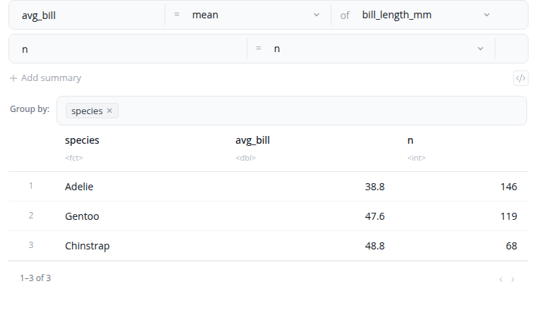

---

## Join Block

The join block combines two datasets based on matching values in specified columns. Select from six join types that determine which rows are kept in the result.

Join types: left_join keeps all rows from the left dataset and matching rows from the right; right_join keeps all rows from the right dataset and matching rows from the left; inner_join keeps only rows that match in both datasets; full_join keeps all rows from both datasets; semi_join filters the left dataset to rows that have a match in the right; anti_join filters the left dataset to rows that do not have a match in the right.

The "Custom Column Mappings" interface supports both same-name joins (when columns have identical names) and different-name joins (when the matching columns have different names in each dataset). Add multiple join keys to match on multiple columns simultaneously. Enable "Use natural join" to automatically join on all common columns.

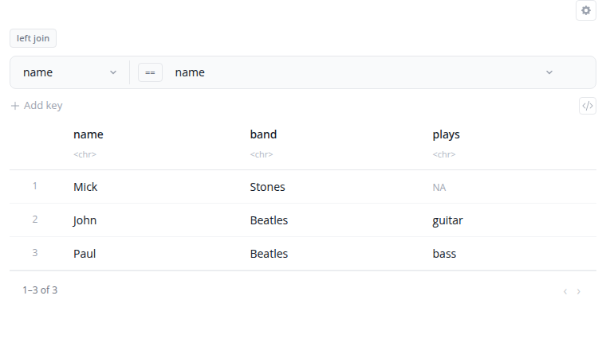

---

## Bind Rows Block

The bind rows block stacks datasets vertically by matching column names. Rows from each input dataset are combined into a single output dataset.

Columns are matched by name. If datasets have different columns, the result includes all columns from all datasets. Missing columns are filled with NA values. The order of columns in the output follows the order they appear across all input datasets.

The "Show advanced options" section provides the id_name option which adds an identifier column that tracks which source dataset each row came from. This is useful when combining data from multiple sources and you need to maintain provenance.

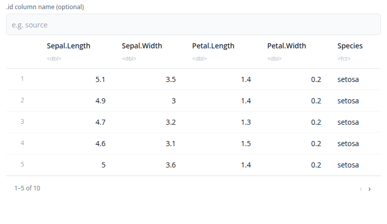

---

## Bind Columns Block

The bind columns block combines datasets side-by-side horizontally. Columns from each input dataset are placed next to each other in the output.

All input datasets must have exactly the same number of rows. The rows are combined by position: the first row from each dataset forms the first row of the output, the second rows form the second row of the output, and so on.

If datasets have columns with the same name, they are automatically renamed with numeric suffixes (e.g., "Sepal.Length...1", "Sepal.Length...6") to avoid conflicts.

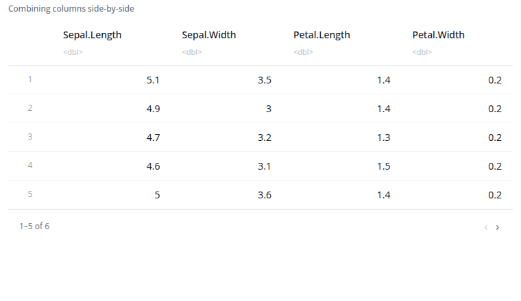

---

# tidyr Blocks

The following blocks provide reshaping operations from the tidyr package.

---

## Pivot Longer Block

The pivot longer block reshapes data from wide to long format using [tidyr::pivot_longer()](https://tidyr.tidyverse.org/reference/pivot_longer.html). Use this when column names represent values of a variable rather than variables themselves.

Select which columns to pivot. These columns are transformed into two new columns: one containing the original column names (names_to parameter, default "name") and another containing the values (values_to parameter, default "value"). Unselected columns remain as identifiers.

The "Show advanced options" section provides names_prefix (removes common prefixes from column names) and values_drop_na (removes rows where the value is NA). This is useful for reshaping time series data, survey responses, or preparing data for visualization.

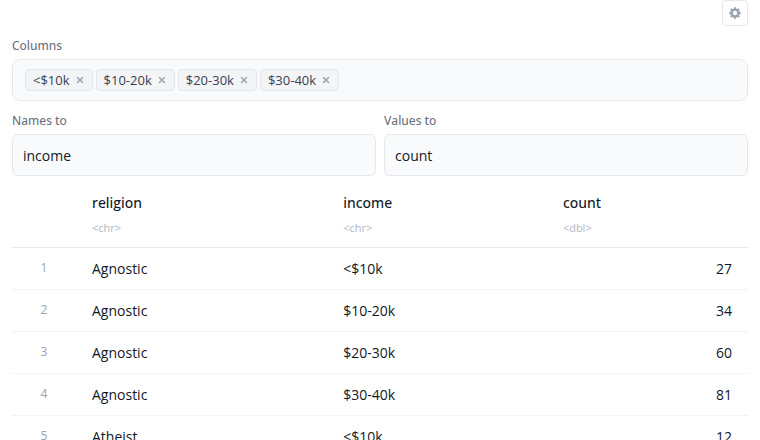

---

## Pivot Wider Block

The pivot wider block reshapes data from long to wide format using [tidyr::pivot_wider()](https://tidyr.tidyverse.org/reference/pivot_wider.html). This is the inverse of pivot longer, creating a summary table where row-column combinations become cells.

Select which column contains values for new column names (names_from) and which column contains cell values (values_from). The id_cols parameter specifies which columns identify each row. If empty, all columns not in names_from or values_from are used as identifiers.

The "Show advanced options" section provides names_prefix (adds a prefix to new column names) and values_fill (provides a value for missing combinations). This is useful for creating crosstabs, pivot tables, or comparing values across categories.

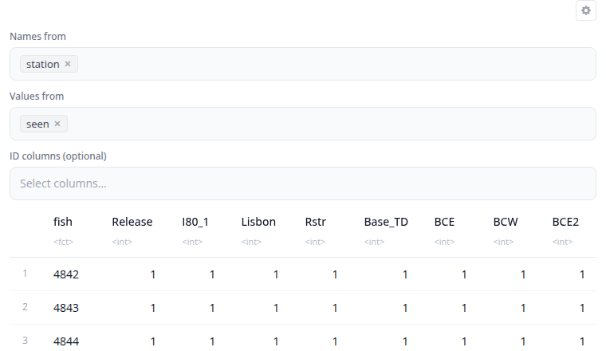

---

## Separate Block

The separate block splits a single column into multiple columns using [tidyr::separate()](https://tidyr.tidyverse.org/reference/separate.html). Use this when a column contains combined values that should be in separate columns.

Select the column to separate and specify the names for the new columns (comma-separated). Enter the separator character or regular expression that divides the values.

The "Show advanced options" section provides remove (whether to remove the input column), convert (whether to convert new columns to appropriate types), and extra/fill options for handling rows with too many or too few pieces.

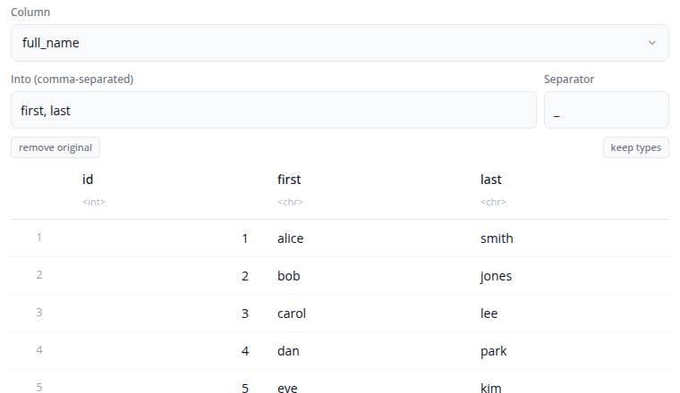

---

## Unite Block

The unite block combines multiple columns into a single column using [tidyr::unite()](https://tidyr.tidyverse.org/reference/unite.html). This is the inverse of separate, joining values with a separator.

Select the columns to unite and specify the name for the new combined column. Enter the separator character to place between values (default is "_").

The "Show advanced options" section provides the remove option (whether to remove the input columns after uniting) and na.rm (whether to remove NA values before uniting).

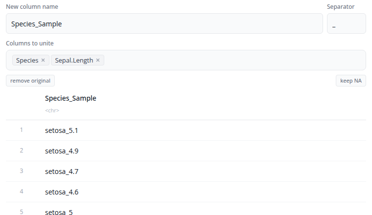

---

## Building Data Pipelines

Blocks work together in pipelines. The output from one block becomes the input to the next. Each block shows a preview of the data at that stage.
