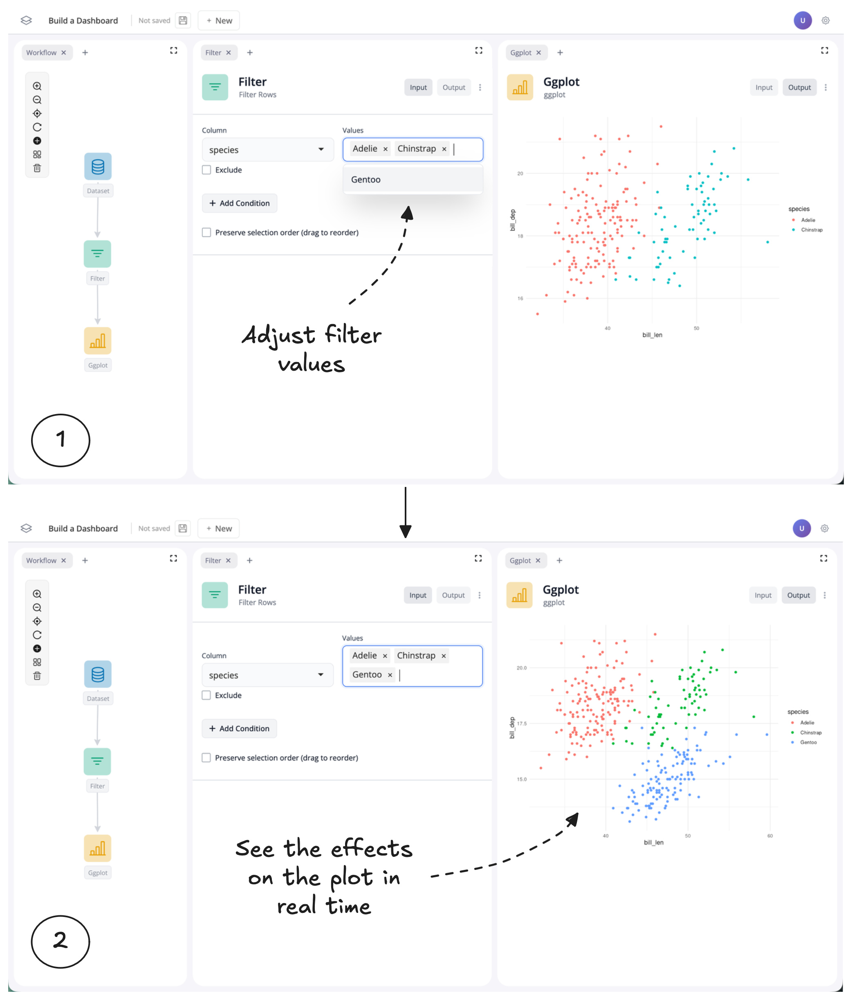
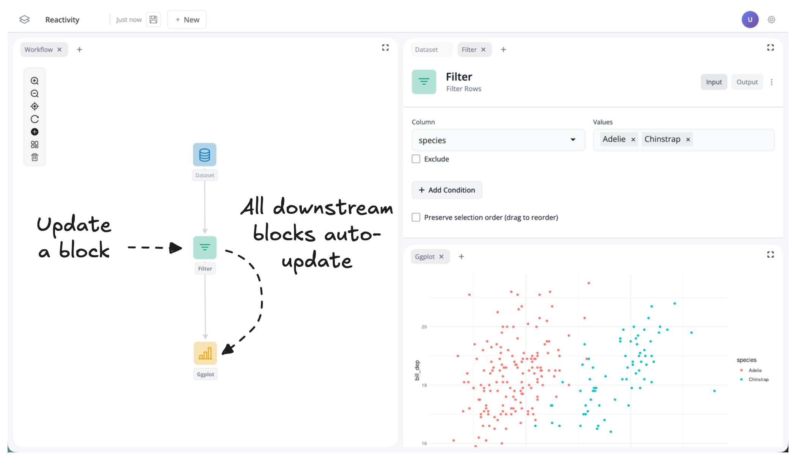
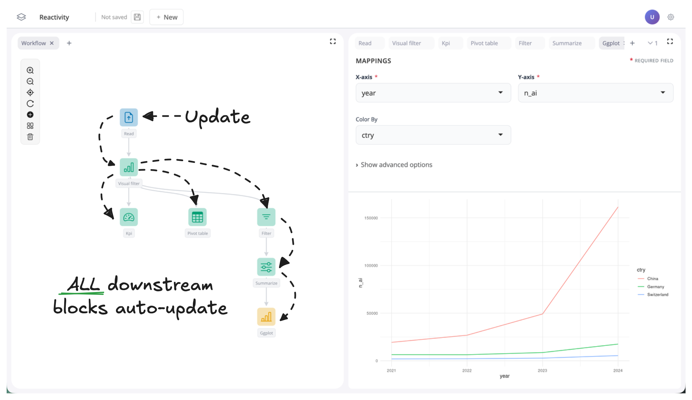
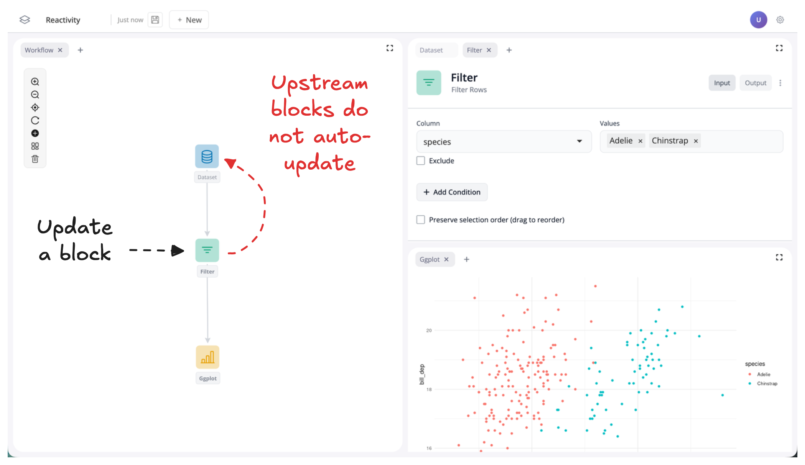
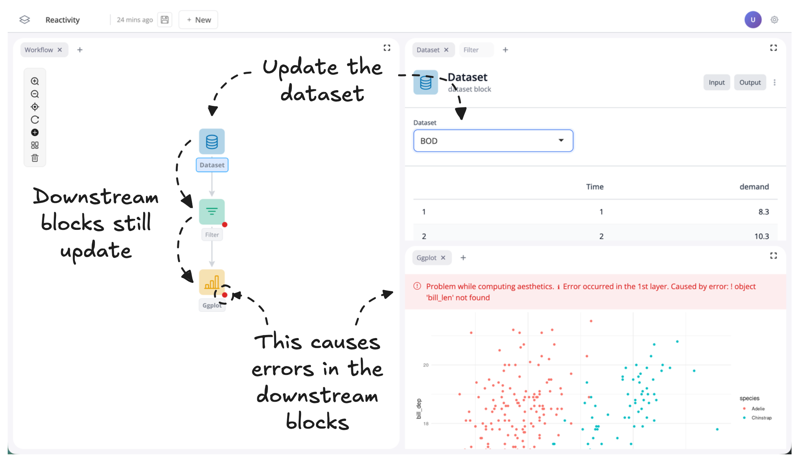

# Reactivity

<VideoEmbed id="_j0dOkGrkew" title="What is blockr?" />

## Overview
blockr uses a concept called reactivity to ensure that any changes you make to a block in your workflow are automatically reflected in all downstream blocks.
This means that when you update one part of your workflow, you don't need to manually trigger updates elsewhere, everything downstream adjusts automatically.
It's the same idea that powers the interactivity you're used to seeing in spreadsheets: if cell A1 contains a price and cell B1 calculates tax with =A1 * 0.2, changing A1 instantly updates B1.
blockr works the same way, but for entire data transformation steps instead of individual cells.

::: info
blockr did not invent reactivity! blockr is built on the [Shiny](https://shiny.posit.co/) framework in R, which itself borrowed the ideas of reactivity from [Meteor](https://www.meteor.com/)
:::

## Example

If you have already completed the [Build a dashboard](../../learn/02-build-a-dashboard) tutorial, you have already seen reactivity in action.
In that tutorial you learnt how to build a simple dashboard which uses a filter to update a plot on penguins:

Let's zoom into the workflow to better understand what is going on.
Here, we can see that as one block updates, all downstream blocks update:

In this example, this results in only a single block updating.

A downstream block is any block that depends on (directly or indirectly) the output of a given block.
In other words, it comes after it in the workflow.
If data flows from A → B → C, then B and C are both downstream of A.
This means that for complicated workflows, a change higher up the workflow can result in many blocks being updated:

Note that upstream blocks never get updated.
In our simple example, this means that our data block does **not** get updated, because it is upstream of our filter block:

## Errors

Sometimes updating a block can causes errors downstream.

For example, again using our simple penguins dashboard, if we update the dataset block to use a dataset other than penguins, it will causes errors downstream:

This happens because the downstream filter and plot blocks user variables from the penguins dataset.
When this dataset changes, these variables are no longer available and so the downstream blocks error to let us know they are trying to use variables that no longer exist.
In this instance to fix these errors, we just need to update the variables used in the downstream blocks to those found in the new dataset.
