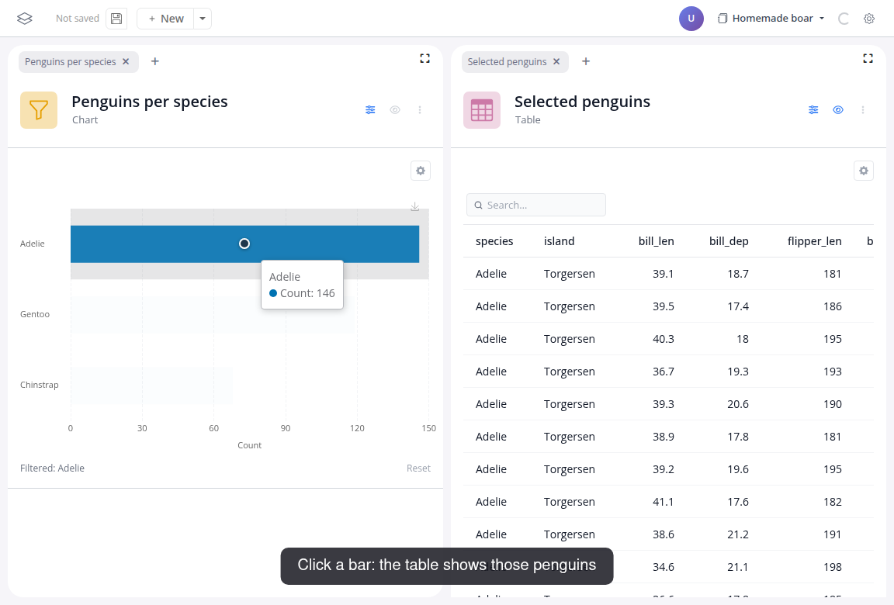

# Reactivity

## Overview
blockr uses a concept called reactivity to ensure that any changes you make to a block in your workflow are automatically reflected in all downstream blocks.
This means that when you update one part of your workflow, you don't need to manually trigger updates elsewhere, everything downstream adjusts automatically.
It's the same idea that powers the interactivity you're used to seeing in spreadsheets: if cell A1 contains a price and cell B1 calculates tax with =A1 * 0.2, changing A1 instantly updates B1.
blockr works the same way, but for entire data transformation steps instead of individual cells.

## Downstream, not upstream

A downstream block is any block that depends, directly or indirectly, on the output of a given block.
If data flows from A → B → C, then B and C are both downstream of A: a change in A recomputes B and C, while a change in B leaves A untouched.

In the pipeline from [Build your first app](../../learn/01-build-your-first-app), changing the filter recomputes the plot, but never the dataset block above it:

The same rule is what makes dashboards live.
In [Build a dashboard](../../learn/02-build-a-dashboard), clicking a bar in the chart filters everything downstream of it, so the table recomputes on every click:

## Errors

A change can invalidate a downstream block: swap the dataset, and a filter that referenced a column of the old data has nothing to work on.
The affected block reports the missing column and lists the columns that exist, and everything downstream of it waits.
Fix the reference and the chain recomputes from there.
