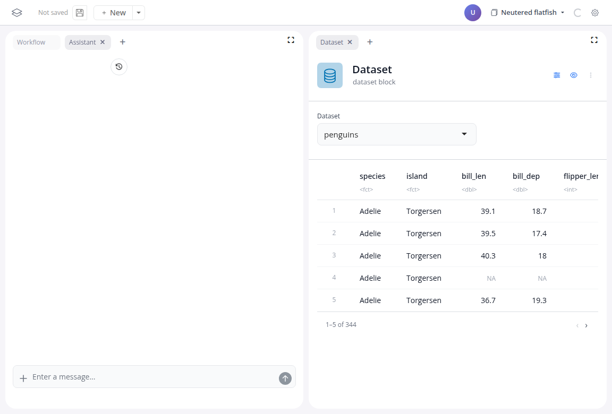

# The AI assistant

The assistant is an optional extension that adds a chat panel to the board. You describe what you want in plain language; it acts on the board through the same operations you would click.

It works at three levels:

- **Board**: describe an analysis ("keep only Adelie and Chinstrap penguins, then chart mean bill length by species") and the assistant adds the blocks, configures them and wires the links. Each action shows up as a tool call in the chat, and the result is an ordinary workflow.
- **Block**: ask for a change to a single block ("also split the chart by island") and the assistant edits that block's settings.
- **[Function block](/learn/04-custom-code)**: describe a transformation no block covers and the assistant writes the R function; you review and run it.

Everything the assistant builds is made of regular blocks: you can inspect, change or delete any of it, and the saved board does not record whether a block was added by hand or by the assistant.

## Requirements

The assistant needs an LLM configured in the deployment (see `blockr.ai`'s model options). Without one, the extension is simply absent from the board. The [Full-Stack Assistant example](https://blockr.cloud/app/full-stack) on blockr.cloud runs it against an empty board; the [Cat Breeds example](https://blockr.cloud/app/catbreeds) has it wired per-block and board-level.
