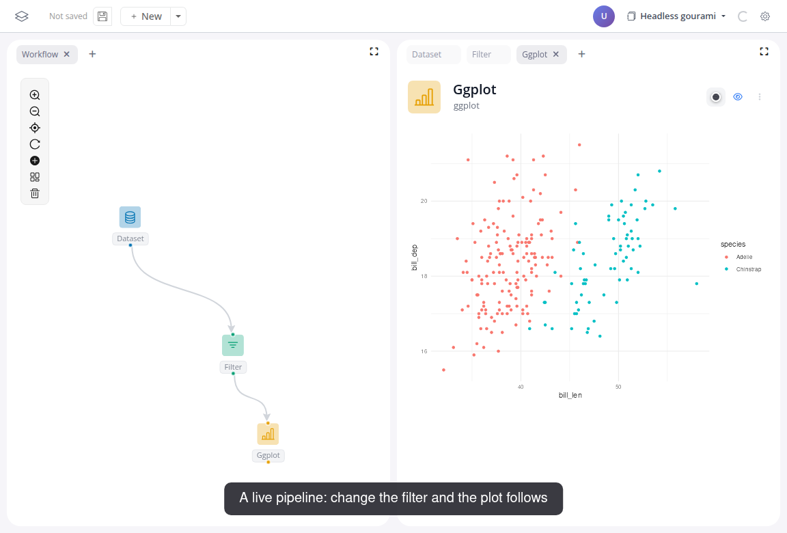
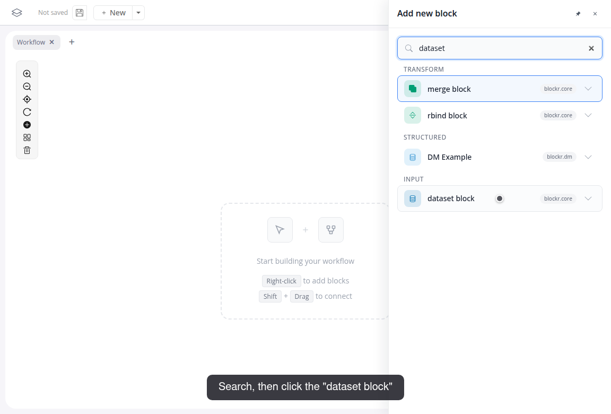
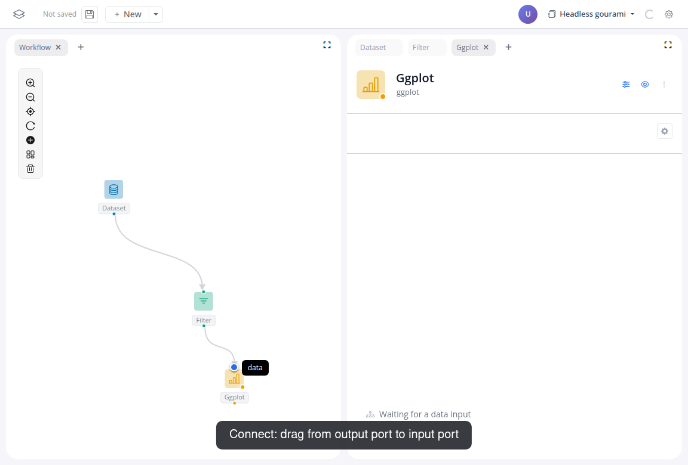

# Build your first app

In this tutorial you build a small app on the penguins dataset: a filter feeding a scatter plot.

Make sure blockr is running. See [Installation](/install) if you haven't set it up yet.

Watch the whole flow, then follow the steps below:

<video controls muted style="width: 100%; border: 1px solid var(--vp-c-divider); border-radius: 8px;" src="/videos/tutorial-01.webm" poster="/videos/tutorial-01-poster.png"></video>

## Do it yourself

1. Right-click the canvas and choose "Add block".
2. Search for "dataset" and click "dataset block":

   

3. In the block panel on the right, pick "penguins" from the Dataset dropdown.
4. Drag from the output port at the bottom of the dataset block to an empty spot on the canvas. The picker opens again, and the block you pick arrives already connected: choose "Filter Rows".
5. In the filter panel, set the column to "species" and pick the values "Adelie" and "Chinstrap". The table under the controls updates: 220 of the 344 penguins remain.
6. Add a "ggplot" block with right-click and "Add block". This one starts unconnected.
7. Connect it: drag from the filter block's output port onto the plot block's input port. The target port shows the name of the input it accepts:

   

8. Map X-axis to "bill_len" and Y-axis to "bill_dep", then click "Add mapping" and set "Color by" to "species".
9. Click the sliders icon in the block header to hide the controls; the block now shows just the plot.

A drag from a port does both connection jobs: release on another block's port to link two blocks, release on empty canvas to add a new, already connected one.

That is the app from the top of the page. Change the filter values and the plot updates: every block downstream of a change recomputes automatically ([reactivity](/docs/concepts/01-reactivity)).

The other dplyr verbs (join, summarize, pivot, ...) are blocks too. The [blockr.dplyr reference](/docs/blocks/blockr.dplyr) lists them.

## Next

Turn this workflow into a dashboard for others to use: [Build a dashboard](02-build-a-dashboard).
