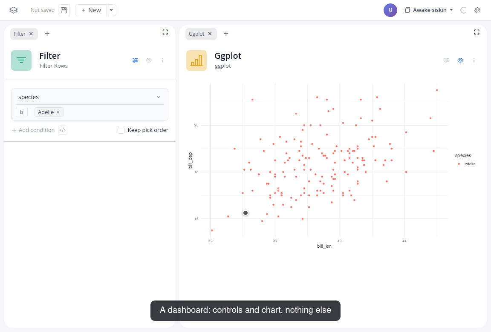
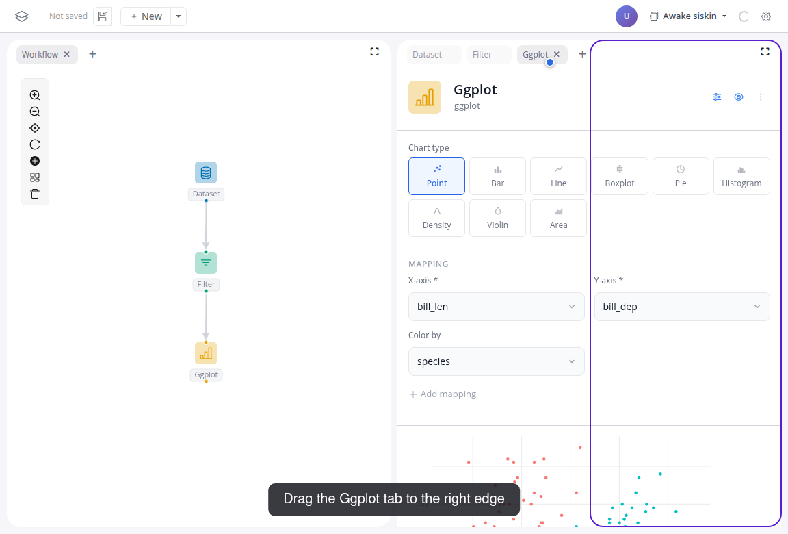

# Build a dashboard

In this tutorial you turn the workflow from the previous tutorial into an interactive dashboard: a chart your users can click, and a table that follows the click.

::: info
This builds on the workflow from [Build your first app](01-build-your-first-app). Complete that tutorial first.
:::

Watch the flow, then follow the steps below:

<video controls muted style="width: 100%; border: 1px solid var(--vp-c-divider); border-radius: 8px;" src="/videos/tutorial-02.webm" poster="/videos/tutorial-02-poster.png"></video>

## Do it yourself

1. Swap the plot for interactive blocks: remove the ggplot block, then add a "Chart" block after the filter and a "Table" block after the chart (add and connect as in the first tutorial). Group the chart by "species" and set its drill column to "species"; the gear in the chart's corner opens its settings.
2. Drag the table tab to the right edge of the window. A colored outline shows where the panel will land; release to give the table its own panel:

   

   The same drag can group panels: drop a tab next to another tab and they share a tab group.

3. Close what your users don't need: the "x" on the Workflow, Dataset and Filter tabs. The "+" next to any tab bar brings panels back.
4. Hide the chart's preview table with the eye toggle in its header. Every block panel has the two toggles: sliders for the controls, eye for the preview.
5. Click a bar. The chart filters everything downstream, so the table now shows exactly those penguins; the label under the chart says which filter is active. Click another bar, or "Reset", and the table follows.

The layout and the toggles are part of the board and are saved and restored with it.

## Next

Need a block that doesn't exist yet? [Create a custom block](05-create-a-block).
