# Build a dashboard

<VideoEmbed id="n7mM_s4-oyQ" title="Creating dashboards in blockr" />

In this tutorial you will turn the penguins workflow from the previous tutorial into a polished dashboard. In blockr, building a dashboard means rearranging, resizing, and hiding windows so that end users see only the controls and outputs they need.

::: info
This tutorial builds on the workflow created in [Build Your First App](01-build-your-first-app).
Complete that tutorial first before proceeding.
:::

## Rearrange your layout

You can drag and drop windows to customize your workspace however you like.
You can move them around, organize them into tabs, remove them, and resize them.
Let's see how each of these features work:

### Move windows

To move a window, grab the grey tab at the top and drag it wherever you like.

Let's start by dragging the plot block down underneath the dataset and filter blocks.
As you drag a window, you'll see a purple highlight showing where it will go when you drop it.

Let's move the plot block below the dataset and filter blocks to see how this works:

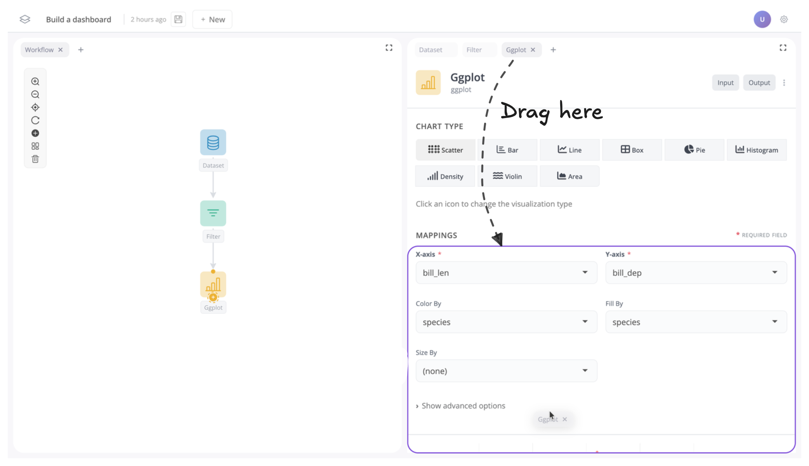

Once moved your app should now look like this:

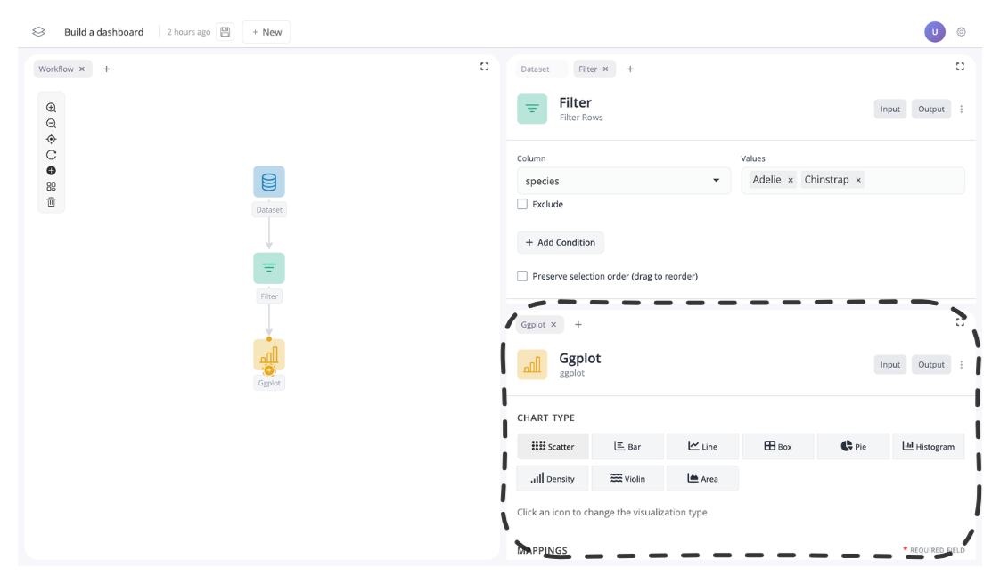

Next, let's move the filter block to the left:

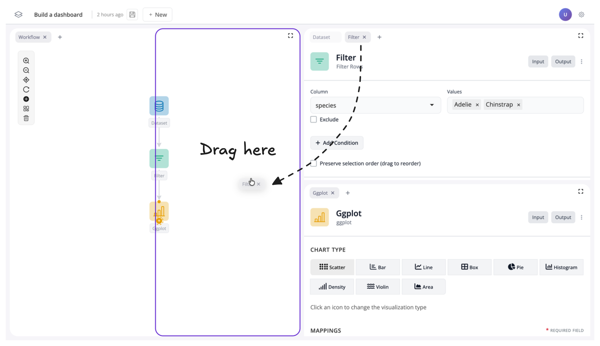

Your app should now look like this:

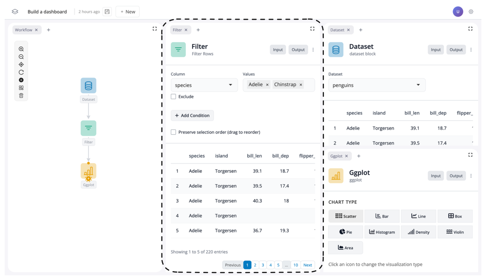

### Group windows

You can also group windows into tab groups.
To do this, simply drag a tab next to another tab to group them together.

For instance, let's move the dataset block from the tab group on the right to the tab group on the left:

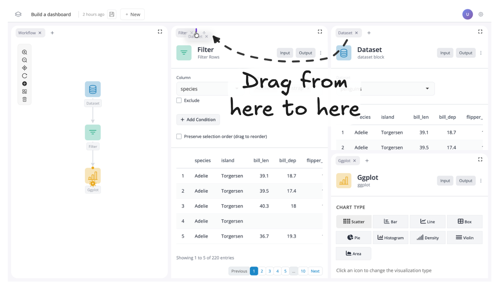

You should now see the dataset block is in the left tab group:

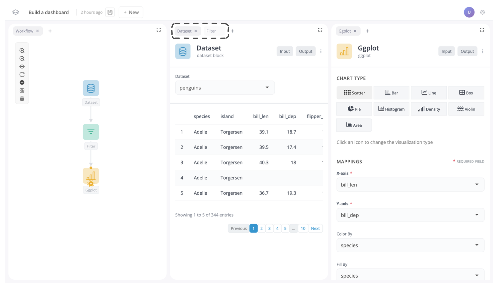

### Remove windows

Sometimes you may wish to just remove a window all together.
To do this, just click on the "x" next to the window name in the tab.

For instance, let's remove the dataset window, as it might not be much use to see in our dashboard:

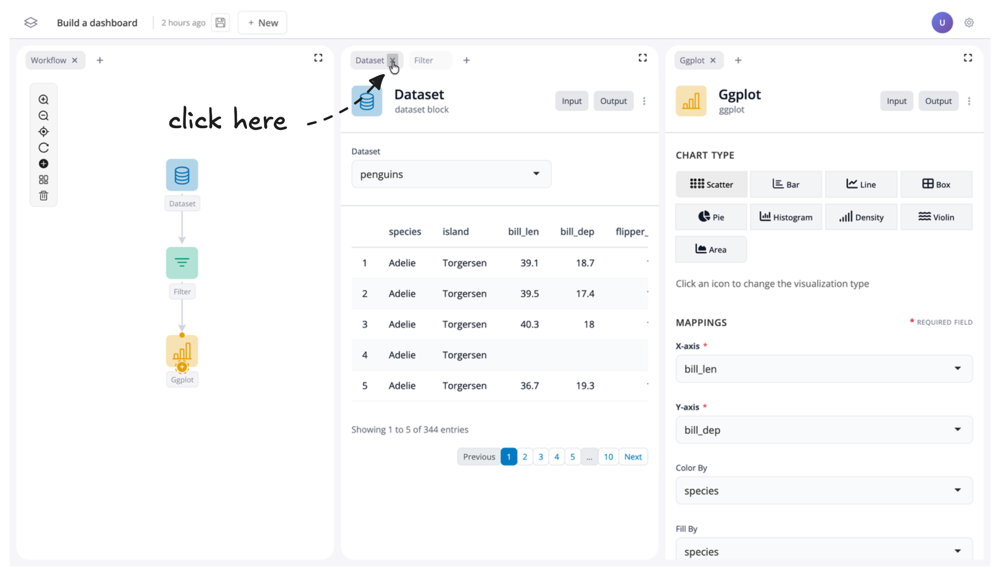

If you want to reverse this, you can also click the "+" button to add a window back into your app:

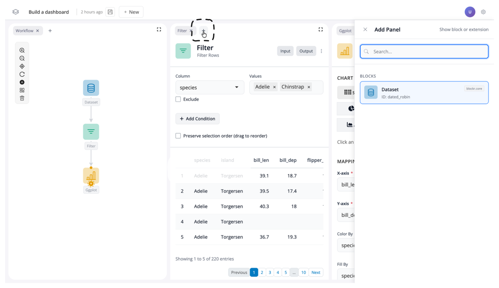

But for now, let's leave the dataset block removed.

### Resize windows

At this point your app should have the graph of blocks on the left, the filter block in the middle, and the plot block on the right.
Each window should take up approximately the same width:

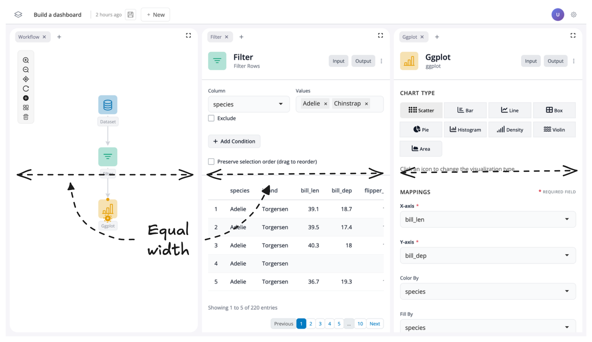

To create more space for our filter and plot blocks, let's resize their windows.
To do this, just drag the edge of the respective window to change its size:

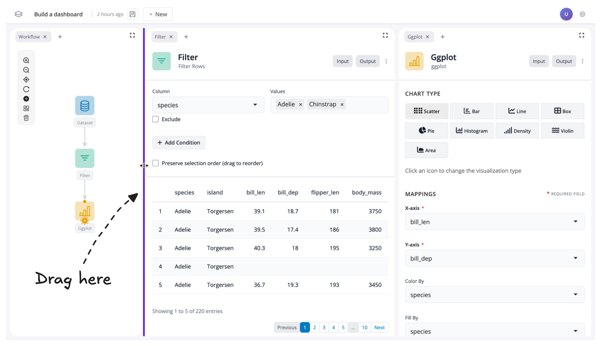

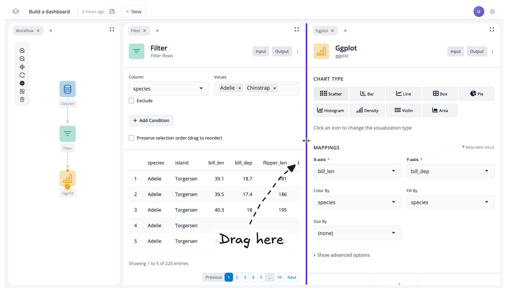

## Toggle inputs/outputs on and off

To finish creating our dashboard, we'll customize what users can see and interact with by controlling the visibility of different parts of our app.

### Understanding Block Inputs and Outputs
Each block has two components:

- Inputs – the controls for a block
- Outputs – the return values (such as data or a plot)

Inside each block, you'll see inputs and outputs separated by a faint grey line:

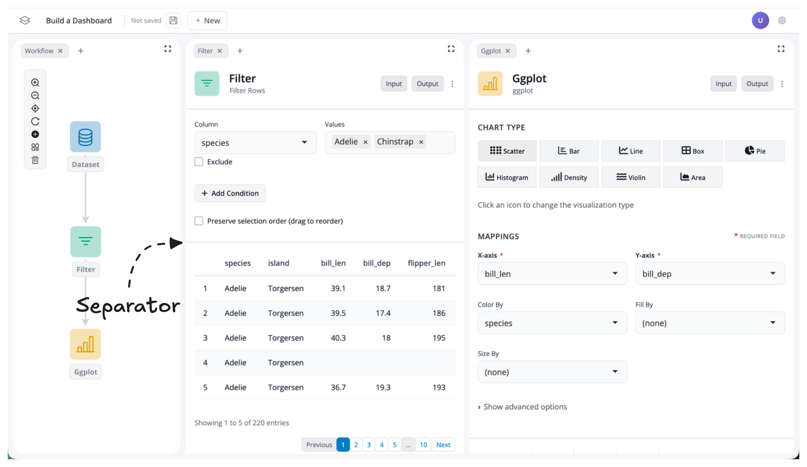

### Toggling Visibility

You can show or hide inputs and outputs using the "Input" and "Output" buttons located in the top-right corner of each block:

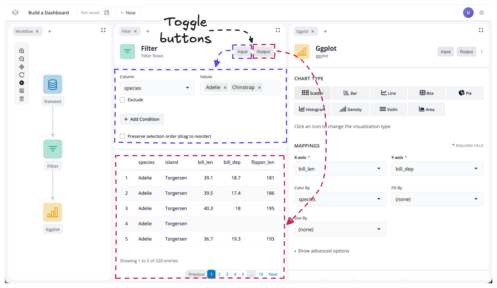

By default, all inputs and outputs are visible.
To change this, simply click the input or output buttons to toggle the respective component on or off.

### Example: Creating a Curated Dashboard View

Let's toggle the output "off" for our filter block and the input "off" for our ggplot block:

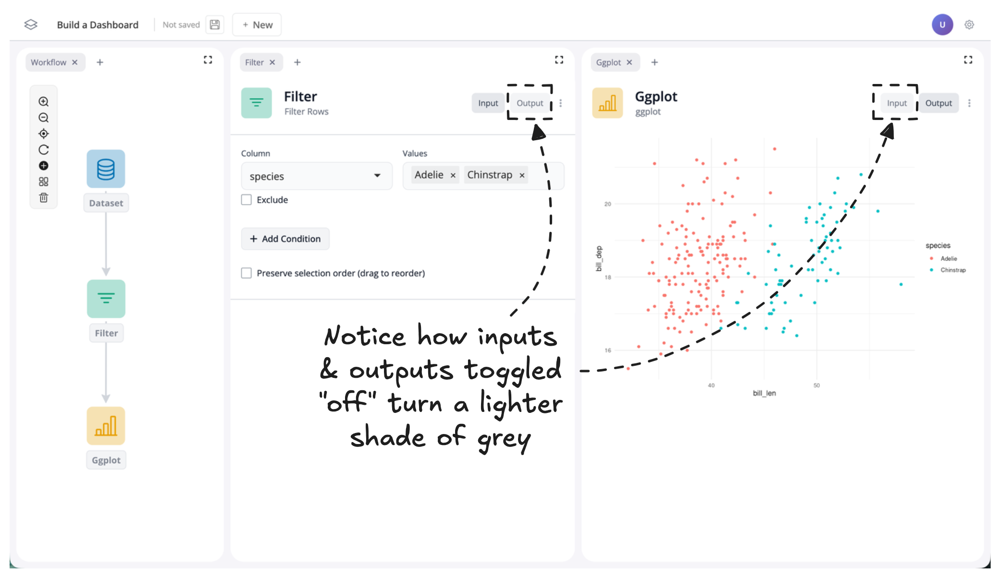

You should now notice two things:

1. The output data table for the filter block and the input controls for the plot block are no longer visible
2. The input/output buttons change color to indicate whether their component is shown or hidden

By hiding the filter outputs and plot inputs, we've created a curated dashboard view where we control what users can see and interact with.
In this case, users can now adjust the filter values and see the effects on the plot in real time, without being distracted by unnecessary components.

## Summary

- **Move windows** by dragging tabs to rearrange your workspace layout
- **Group windows** into tabs by dragging them next to each other
- **Remove windows** using the "x" button (and add them back with the "+" button)
- **Resize windows** by dragging their edges to emphasize important components
- **Toggle inputs and outputs** on and off using the buttons in the top-right corner of each block

## Next steps

- [Export code](/videos/exporting-data): get the R code behind your pipeline
- [Visualising data](/videos/visualising-data): all chart types and customization options
