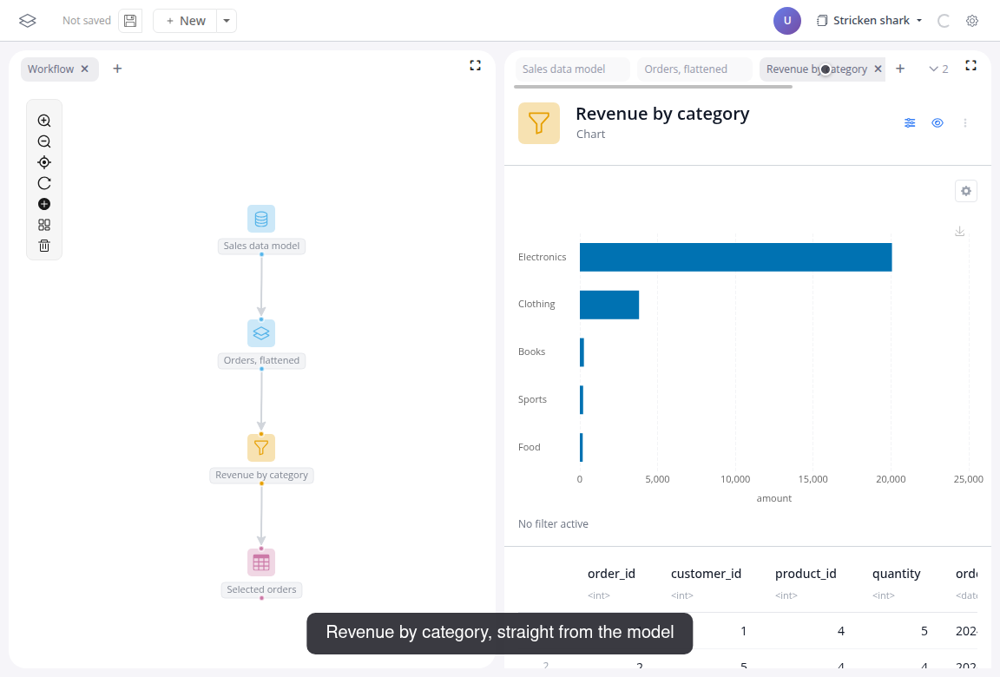
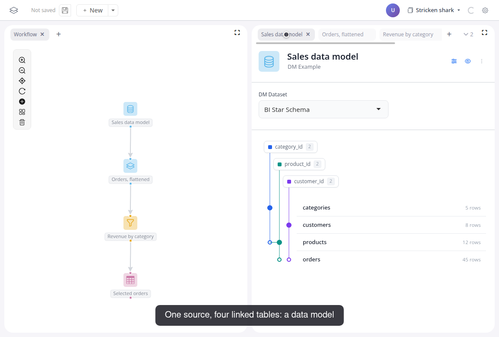

# Work with many tables

One data frame is rarely the whole story. This tutorial loads a data model, four linked tables with keys, flattens it into one analysis table, and charts it.

Watch the flow, then follow the steps below:

<video controls muted style="width: 100%; border: 1px solid var(--vp-c-divider); border-radius: 8px;" src="/videos/tutorial-03.webm" poster="/videos/tutorial-03-poster.png"></video>

## Do it yourself

1. Add a "DM Example" block and pick "BI Star Schema". Its preview draws the model: categories, products, customers and orders, with the key relationships as lines:

   

2. Add a "Flatten dm" block after it. Start from "orders" and leave "Recursive" on: the output is one flat table, every order joined with its product, category and customer columns along the keys.
3. Add a "Chart" block after that: group by "category_name", value "amount", function "sum", drill on "category_name".
4. Add a "Table" block after the chart. Click a bar in the chart: the table shows the orders behind it, like in the previous tutorial.

For your own relational data, the other dm blocks read models from files or a database connection; the [blockr.dm reference](/docs/blocks/blockr.dm) lists them. And the same blocks run on lazy database tables: the [DuckDB demo](https://blockr.cloud/app/duckdb-lazy) pages through 100 million rows without ever materializing them.

## Next

Need a block that doesn't exist yet? [Create a custom block](05-create-a-block).
