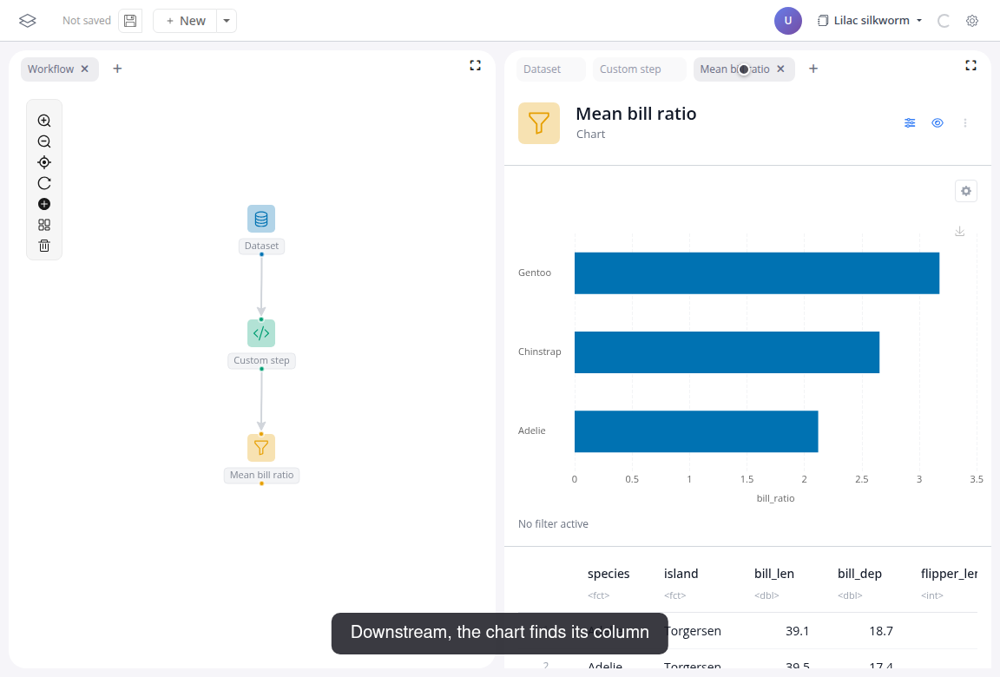
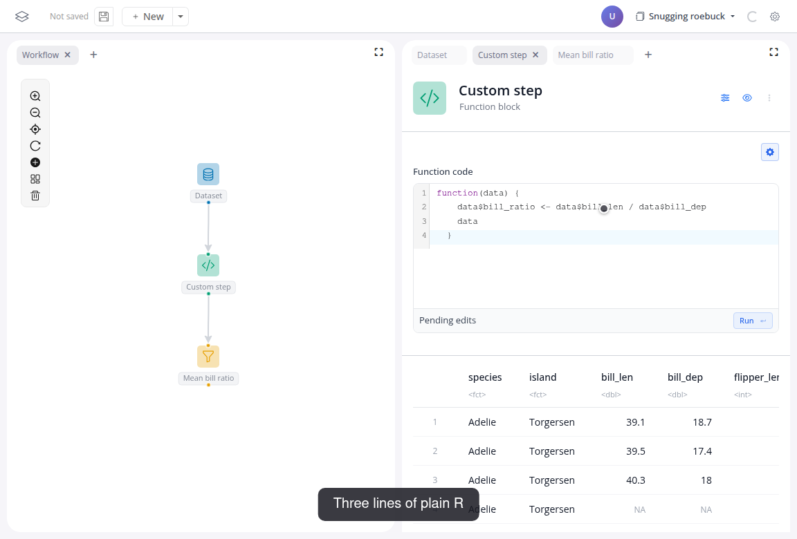

# Custom code

The function block runs an R function as a workflow step: it receives the data from the upstream block, and what it returns flows downstream. Use it when no block does the transformation you need.



Watch the flow, then follow the steps below:

<video controls muted style="width: 100%; border: 1px solid var(--vp-c-divider); border-radius: 8px;" src="/videos/tutorial-04.webm" poster="/videos/tutorial-04-poster.png"></video>

## Do it yourself

1. Add a "Function block" after a dataset block with "penguins". Its preview shows the data passing through, unchanged.
2. In the function block's panel, click the edit icon and write:

   ```r
   function(data) {
     data$bill_ratio <- data$bill_len / data$bill_dep
     data
   }
   ```

   

3. Click "Run". The preview gains a "bill_ratio" column.
4. Add a "Chart" block after the function block: group by "species", value "bill_ratio", function "mean".

If the AI assistant is enabled in your deployment, it can write the function from a description; you review and run it.

## Next

If the same function recurs across boards, make it a block of its own: [Create a custom block](05-create-a-block).
